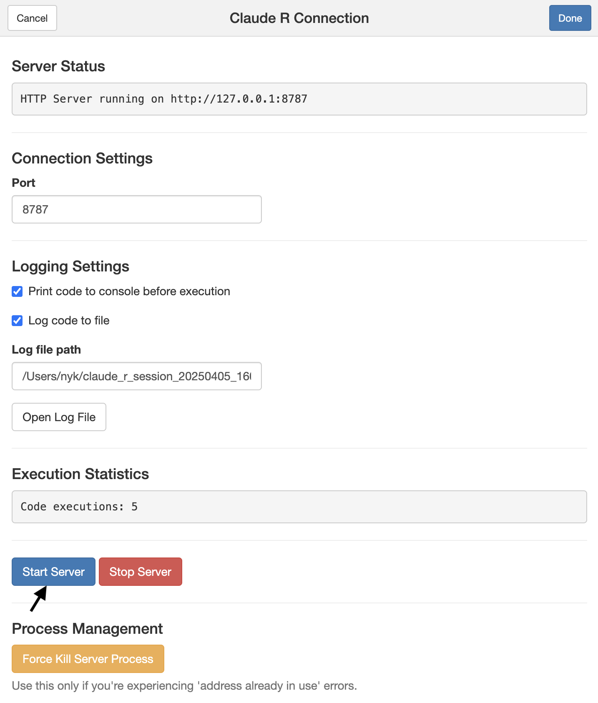

# ClaudeR


- ClaudeR is an R package that creates a direct connection between RStudio and Claude AI, allowing for interactive coding sessions where Claude can execute code in your active RStudio session and see the results in real-time.

- It can explore the data autonomously, or be a collaborator. The choice is yours.

# Features

- Direct Code Execution: Claude can write and execute R code in your active RStudio session (including installing packages)
- Visualization Creation: Claude can generate, see, and refine plots and visualizations 
- Data Analysis: Claude can analyze your datasets and iteratively provide insights
- Code Logging: All code executed by Claude can be saved to log files for future reference
- Console Printing: Option to print Claude's code to the console before execution
- Environment Integration: Claude can access variables and functions in your R environment

# Installation
Prerequisites:

1) R 4.0+ and RStudio
2) Python 3.8+ For the MCP server component
3) Claude Desktop App: The desktop version of Claude AI

# Step 1: Install R Package Dependencies
```bash
install.packages(c(
  "R6",
  "httpuv",
  "jsonlite", 
  "miniUI",
  "shiny", 
  "base64enc",
  "rstudioapi",
  "devtools"
))
```
# Step 2: Install Python Dependencies

```bash
pip install mcp httpx
```

# Step 3: Install ClaudeR from GitHub
```bash
devtools::install_github("IMNMV/ClaudeR")
```

# Step 4: Configure Claude Desktop
Locate or create the Claude Desktop configuration file:
```bash
Mac: ~/Library/Application Support/Claude/claude_desktop_config.json
Windows: %APPDATA%\Claude\claude_desktop_config.json
```

Add the following to the configuration file:

```bash
{
  "mcpServers": {
    "r-studio": {
      "command": "python",
      "args": ["PATH_TO_REPOSITORY/ClaudeR/inst/scripts/persistent_r_mcp.py"],
      "env": {
        "PYTHONPATH": "PATH_TO_PYTHON_SITE_PACKAGES",
        "PYTHONUNBUFFERED": "1"
      }
    }
  }
}
```
Replace
- PATH_TO_REPOSITORY with the path to where the package is installed (use find.package("ClaudeR") in R to locate it)
- PATH_TO_PYTHON_SITE_PACKAGES with the path to your Python site-packages directory

# Usage
Starting the Connection

1) Load the ClaudeR package and start the addin:

```bash
library(ClaudeR)
claudeAddin()
```

2) In the addin interface:


- Click "Start Server" to launch the connection
- Configure logging settings if desired
- Keep the addin window active while using Claude (you can switch to other views like Files, Plots, Viewers, etc. - just don't hit the stop sign/stop button)

3) Open Claude Desktop and ask it to execute R code in your session

# Logging Options
The ClaudeR addin provides several logging options:

- Print Code to Console: Shows Claude's code in your R console before execution
- Log Code to File: Saves all code executed by Claude to a log file
- Custom Log Path: Specify where log files should be saved

Each R session gets its own log file with timestamps for all code executed. That means all code made from chats will be saved in a single log file until the R session is restarted.

# Example Interactions
Once connected, you can ask Claude things like:

- "I have a dataset loaded in my env named data, please perform exploratory data analysis on it and run relevant statistical analyses."
- "Load the mtcars dataset and create a scatterplot of mpg vs. hp with a trend line"
- "Fit a linear model to predict mpg based on weight and horsepower"
- "Generate a correlation matrix for the iris dataset and visualize it"
- "Create a function to calculate moving averages of a time series"

All in all, if you (a human) can do it with R, Claude can do it with R. Go nuts with it. 

# Important Notes

- Session Persistence: All variables, data, and functions created by Claude remain in your R session even after you close the connection
- Code Visibility: By default, code executed by Claude is printed to your console for transparency
- Port Configuration: The default port is 8787, but you can change it if needed
- Log Files: Each R session gets its own log file when logging is enabled
- Claude can install packages if you ask it to. Be careful with this - good prompting is very important. By default it tends to try other methods if it fails, but telling it what it should or shouldn't do as part of the initial prompt is good practice.

# Troubleshooting

For Connection Issues:

- Make sure Claude Desktop is properly configured
- Check that the Python path is correct in your config file
- Verify that you've started the server in the addin interface
- Try restarting RStudio if the port is already in use
- Most server issues can be solved by restarting the R session. Make sure to save your work before you do. 

For Python Dependency Issues:

- Ensure you've installed the required Python packages: mcp and httpx
- Check that your Python environment is accessible

Claude Can't See Results:

- Make sure the addin is running (the window must stay open)
- Check that the server status shows "Running"
- Verify there are no error messages in the R console

Warnings:

- You may get a warning after installing dev tools, this will not mess with functionality. Bugs still exist, but I will work on fixing them as they arise.


- If you stop the server then re-start it in the same R session, you may see the following:


"Listening on http://127.0.0.1:3071

createTcpServer: address already in use

Error starting HTTP server: Failed to create server"

This is a UI bug. The server is still active, and you can have Claude run code like normal. However, to fully end the server you will need to restart RStudio.


# Limitations

- The addin window must remain open for the connection to work
- Each R session can only connect to one Claude session at a time

# License
MIT

# Contributing

Contributions are welcome! Please feel free to submit a Pull Request.

  
